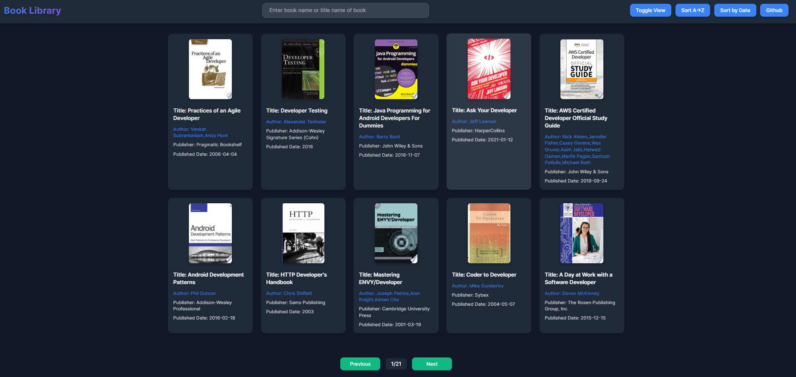

# Books Library

A dynamic **Books Library** web application that fetches and displays book data using the **FreeAPI.app**. Users can search, sort, and toggle between grid/list views for a seamless browsing experience.

## Live Demo

[Click here to view the deployed app](https://kshitizrana.github.io/Book-Library/)

## Features

- Fetches books dynamically from FreeAPI.app.
- Toggle between **grid** and **list** views.
- Search books by **title** or **author**.
- Sort books **alphabetically** or by **release date**.
- Pagination for seamless browsing.
- Clicking on a book opens more details in a **new tab**.

## Tech Stack

- **HTML**
- **CSS**
- **JavaScript**
- **FreeAPI.app** (Books API)

## API Endpoint

```bash
GET https://api.freeapi.app/api/v1/public/books
```

[API Documentation](https://freeapi.hashnode.space/api-guide/apireference/getBooks)

## Project Structure

```
books-library/
│-- index.html
│-- style.css
│-- script.js
│-- README.md
```

## Installation & Usage

1. Clone the repository:
   ```bash
   git clone https://github.com/KshitizRana/books-library.git
   ```
2. Navigate to the project folder:
   ```bash
   cd books-library
   ```
3. Open `index.html` in your browser or use a local server.

## Deployment

The project is deployed on github pages.

- **Live URL**: [Book Library preview](https://kshitizrana.github.io/Book-Library/)

## Screenshots



## Contributing

Contributions are welcome! Feel free to fork and submit a pull request.
